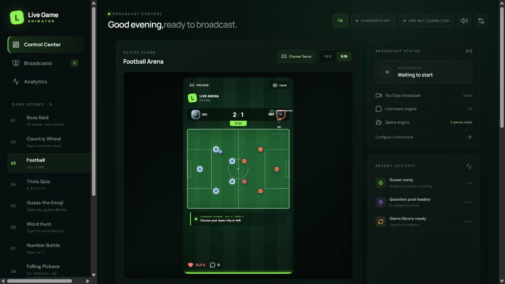
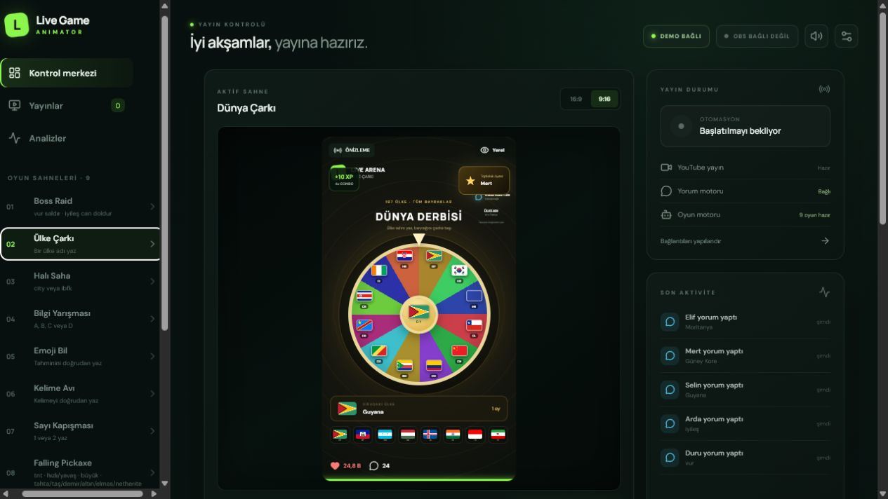
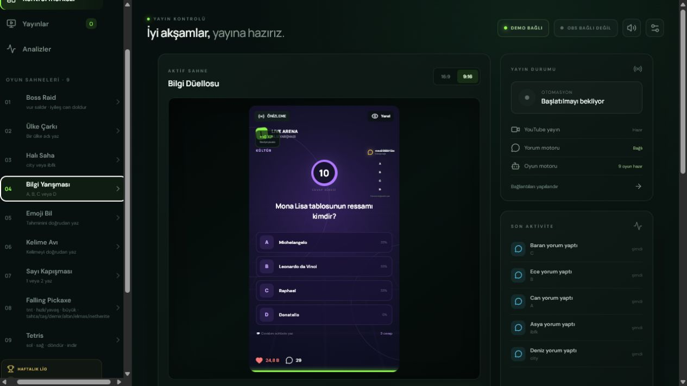

# Live Game Animator

Interactive YouTube and TikTok live-stream games controlled by chat comments. Built for OBS with 16:9 and 9:16 layouts.



## English

### Features

- 9 games: Boss Raid, Country Wheel, Football, Trivia Quiz, Guess the Emoji, Word Hunt, Number Battle, Falling Pickaxe and Tetris
- YouTube live comments and TikTok/external webhook bridge
- OBS WebSocket, automatic rotation, infinite mode, moderation, XP and analytics
- English interface, content and commands; `!` is optional

### Game Gallery

| Boss Raid | Country Wheel | Football |
| --- | --- | --- |
|  |  |  |
| Trivia Quiz | Guess the Emoji | Word Hunt |
|  |  |  |
| Number Battle | Falling Pickaxe | Tetris |
|  |  |  |

### Run

```bash
npm ci
npm run dev
```

- English dashboard: `http://127.0.0.1:5173/?lang=en`
- English OBS source: `http://127.0.0.1:5173/?stage=1&lang=en`

## Türkçe

YouTube ve TikTok canlı yayın yorumlarını OBS üzerinde oynanan etkileşimli oyunlara dönüştürür.


- Türkçe panel: `http://127.0.0.1:5173/`
- Türkçe OBS kaynağı: `http://127.0.0.1:5173/?stage=1`

Gereksinimler: Node.js 20+, OBS Studio 28+ ve Windows 10/11.

```bash
npm run check:release
```

Secrets are kept in process memory. Never commit API keys, stream keys, OBS passwords or `.live-game-animator/`.

## License

[Apache License 2.0](LICENSE) · [Third-party notices](THIRD_PARTY_NOTICES.md)
