# Live Game Animator — Forum Satış Konusu

## Başlık seçenekleri

1. **[SATILIK] YouTube & TikTok Canlı Yayın Oyun Otomasyonu | 9 Etkileşimli Oyun | OBS Entegrasyonu**
2. **Canlı Yayınlarınızı Oyuna Dönüştürün: 9 Oyunlu YouTube / TikTok Etkileşim Sistemi**
3. **OBS Uyumlu Canlı Yayın Oyun Paketi | Yorumlarla Oynanan 9 Oyun | Otomatik Rotasyon**

---

## YouTube ve TikTok canlı yayınlarınızı izleyicilerin oynadığı bir arenaya dönüştürün

**Live Game Animator**, canlı yayın yorumlarını gerçek zamanlı oyun komutlarına dönüştüren, OBS ile kullanılabilen yerel bir yayın ve etkileşim sistemidir. Yayıncı oyunları tek tek yönetebilir veya otomatik rotasyona bırakabilir. İzleyiciler ek bir uygulama kurmadan doğrudan canlı sohbetten oyuna katılır.

> Sistem sahte izlenme, sahte yorum veya yapay izleyici üretmez. Gerçek canlı yayın yorumlarını oyun etkileşimine dönüştürür. Gelir, izlenme saati veya platform onayı garantisi vermez.

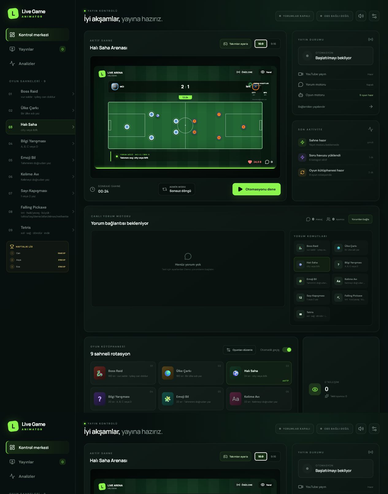

## Pakette bulunan 9 oyun

### 1. Boss Raid — Topluluk Savaşı

- Altı farklı boss: Korzar, Vargul, Nyxara, Thundrok, Morgath ve OMEGA-9
- Her bossa özel karakter görseli, animasyonlu tema ve saldırı yeteneği
- İzleyiciler `vur` veya `saldır` yazarak bossa hasar verir
- `iyileş` komutuyla topluluk canı yenilenir
- Boss da topluluğa saldırır; topluluk yenilirse savaş düzgün biçimde yeniden başlar
- Kullanıcı hasarı, boss hasarı, topluluk canı ve saldırı sayıları ekranda görünür
- Sonsuz modda bosslar sırayla gelmeye devam eder

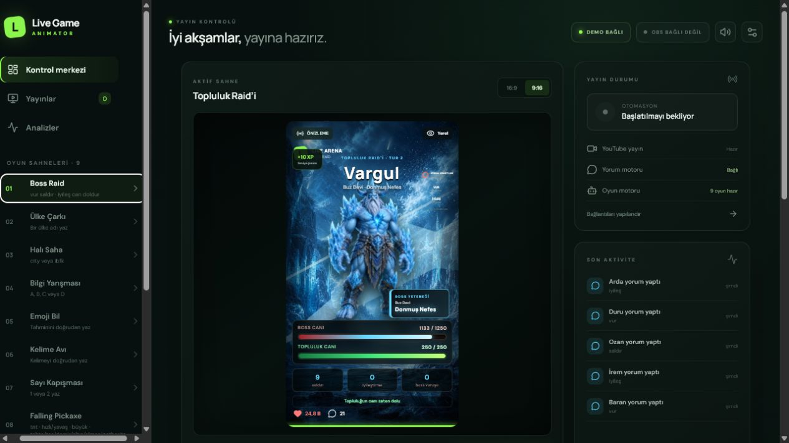

### 2. Ülke Çarkı — Dünya Derbisi

- 197 ülke ve ülke bayrakları
- İzleyici ülke adını yazarak oy verir
- Canlı oy dağılımı, seçilen ülke ve hareketli çark animasyonu
- Türkçe ülke adları ve kabul edilen yazım varyasyonları

### 3. Halı Saha Arenası

- 32 yerli ve yabancı büyük takım
- Galatasaray, Fenerbahçe, Beşiktaş, Trabzonspor, Real Madrid, Barcelona, Liverpool, Manchester City, Bayern Münih, PSG ve daha fazlası
- Yönetim ekranından ev sahibi ve deplasman takımını seçme
- Takıma özel yorum komutları, canlı skor ve gol animasyonları

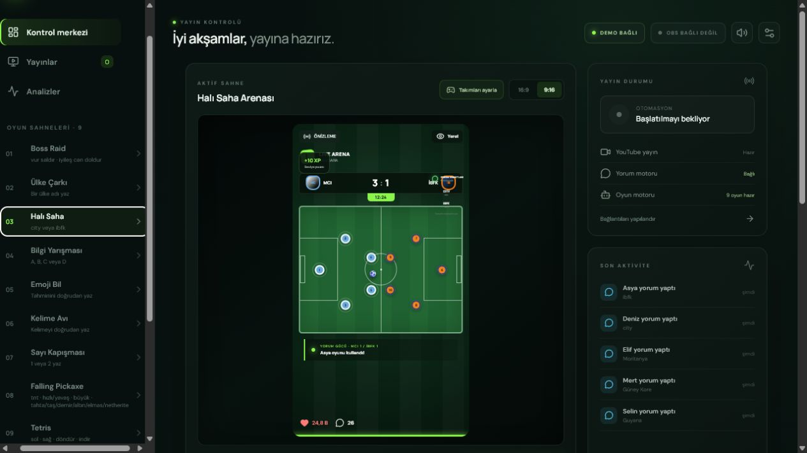

### 4. Bilgi Yarışması

- 80 farklı soru
- A, B, C veya D yorumuyla cevap verme
- Doğru cevap, oy dağılımı, geri sayım ve kazanan takibi

### 5. Emoji Bil

- 80 farklı emoji bulmacası
- Üç ipucu ve doğrudan cevap sistemi
- Doğru bilenlerin ve deneme sayısının takibi

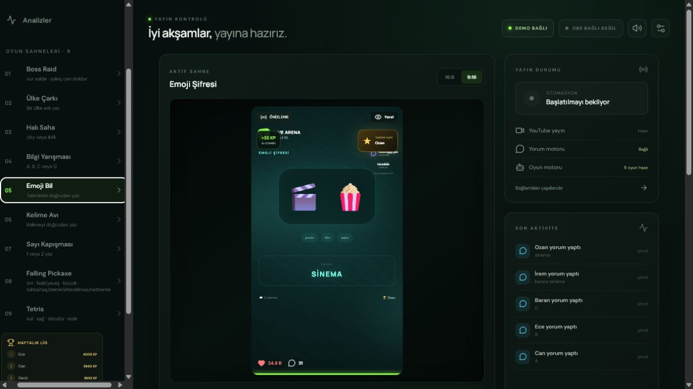

### 6. Kelime Avı

- 120 kelimelik içerik havuzu
- Kategori ve büyük, okunaklı ipucu gösterimi
- İzleyiciler cevabı doğrudan yazar; doğru bilenler anında işlenir

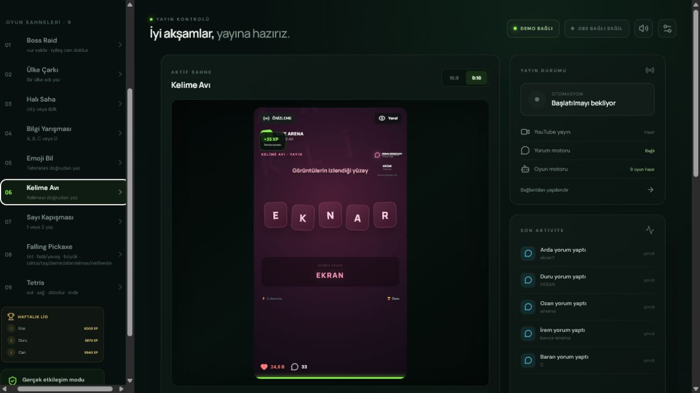

### 7. Sayı Kapışması

- İzleyiciler `1` veya `2` yazarak taraf seçer
- Canlı oy yüzdeleri, taraf güçleri ve sonuç animasyonu
- Hızlı turlar için uygun, kolay katılımlı oyun yapısı

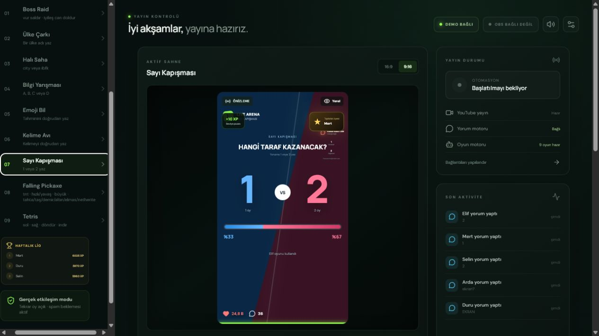

### 8. Falling Pickaxe — Düşen Kazma Madeni

- Minecraft esintili blok, maden ve kazma görselleri
- Fizik tabanlı kazma hareketi ve sürekli ilerleyen maden alanı
- `tnt`, `mega`, `hızlı`, `yavaş`, `büyük` ve kazma yükseltme komutları
- Tahta, taş, demir, altın, elmas ve netherite kazma seviyeleri
- Toplanan madenlerin canlı sayaçları
- Vycdev Falling Pickaxe çalışmasından esinlenen, proje için geliştirilmiş oyun mekaniği

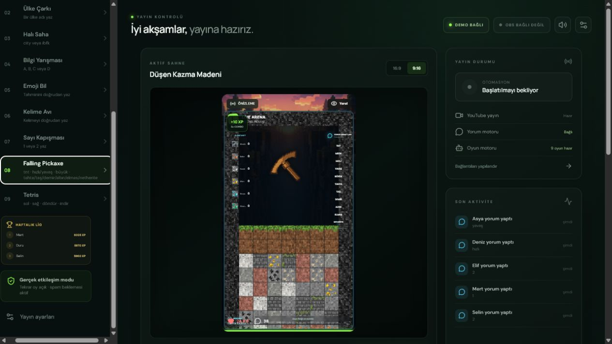

### 9. Topluluk Tetris

- 10 × 18 oyun alanı ve yedi klasik tetromino
- `sol`, `sağ`, `döndür` ve `indir` yorum komutları
- Canlı skor, satır sayısı, sıradaki parça ve yorum geçmişi
- Topluluğun birlikte yönettiği kesintisiz oyun düzeni

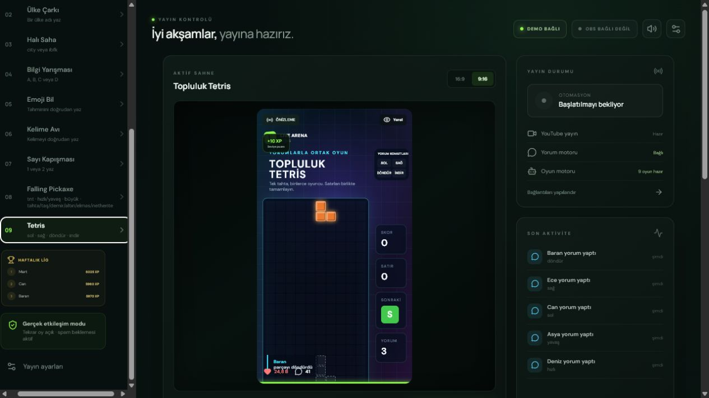

## Genel özellikler

- **Ünlem zorunlu değil:** `vur` ile `!vur`, `tnt` ile `!tnt` aynı şekilde çalışır
- **Tek oy sınırı yok:** Kullanıcılar belirlenen spam bekleme süresinden sonra tekrar katılabilir
- **Sonsuz döngü:** Yönetici oyunu değiştirene veya yayını durdurana kadar seçili oyun devam eder
- **Otomatik rotasyon:** Oyun sırası ve her oyunun süresi yönetim ekranından düzenlenebilir
- **16:9 ve 9:16:** YouTube yatay yayınları ile TikTok / Shorts dikey yayınlarına uygun iki sahne oranı
- **Ekran içi komut rehberi:** Her oyunun kabul ettiği yorumlar oyun ekranında görünür
- **XP ve seviye sistemi:** Katılım puanı, combo, haftalık liderlik ve tur sonu ilk üç ekranı
- **Üye kozmetikleri:** Üye rozeti ve görsel efektler; ücretli oyun avantajı verilmez
- **Ses sistemi:** Tur, doğru cevap, gol ve oyun olaylarına bağlı sesler; ses seviyesi yönetilebilir
- **Moderasyon:** Yasaklı kelimeler, azami mesaj uzunluğu ve kullanıcı bazlı spam bekleme süresi
- **Kayıt ve analiz:** Yayın geçmişi, yorum/komut sayıları, oyun dağılımı, engellenen mesajlar ve liderlik verileri saklanır
- **Oyunla uyumlu demo yorumları:** Canlı bağlantı olmadan bütün oyunlar denenebilir

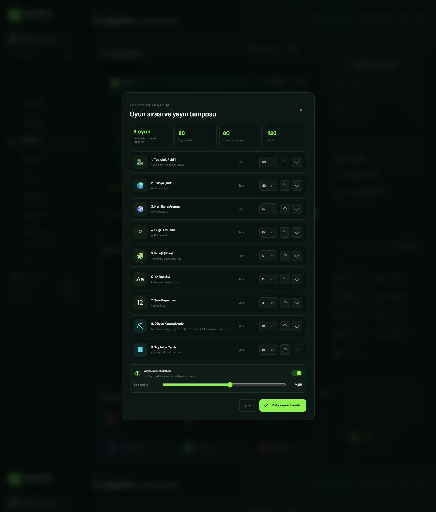

## OBS, YouTube ve TikTok bağlantısı

- OBS 28+ ile gelen **OBS WebSocket** desteği
- OBS Browser Source için hazır yerel sahne adresi
- YouTube Data API üzerinden düşük gecikmeli canlı yorum bağlantısı
- YouTube API kotası için normal ve yedek sorgulama düzeni
- TikTok veya başka yorum sağlayıcıları için güvenli webhook köprüsü
- YouTube ve TikTok RTMP sunucu/yayın anahtarı alanları
- Yayın başlığı, açıklaması ve etiketlerini panelde hazırlayıp kopyalama
- Aynı anda iki platforma yayın için OBS Multiple RTMP Outputs, ikinci OBS çıkışı veya harici restream hizmeti kullanılabilir

> TikTok, doğrudan ve herkese açık resmî canlı yorum API'si sunmadığı durumlarda uyumlu bir yorum sağlayıcısı veya webhook köprüsü gerektirir. RTMP yalnızca görüntü ve sesi taşır.

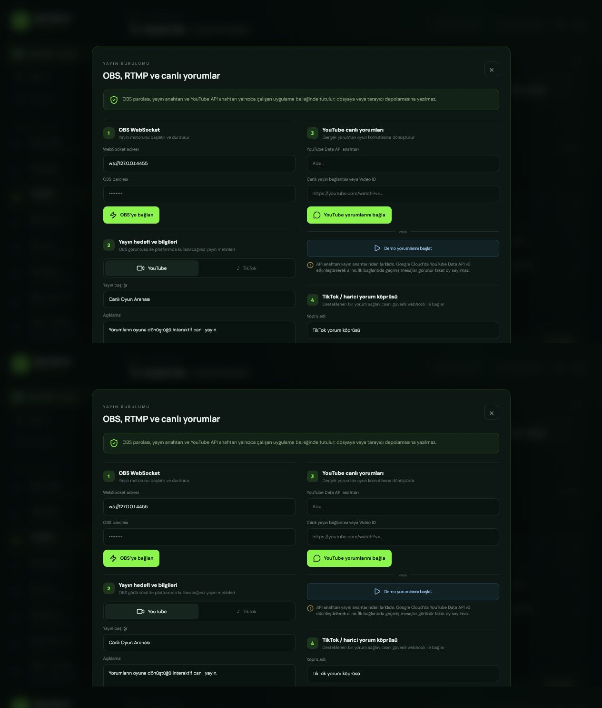

## Yönetim ve raporlama

- Takım seçme ve eşleşme hazırlama ekranı
- Oyun sırası, tur süresi ve otomatik geçiş ayarları
- Yayın geçmişi ve bağlantı kontrol listesi
- Oyun bazında gerçek Türkçe adlarla analiz grafikleri
- Haftalık XP / seviye liderlik tablosu
- Otomatik moderasyon ayarları
- OBS ve platform bağlantı durumu göstergeleri

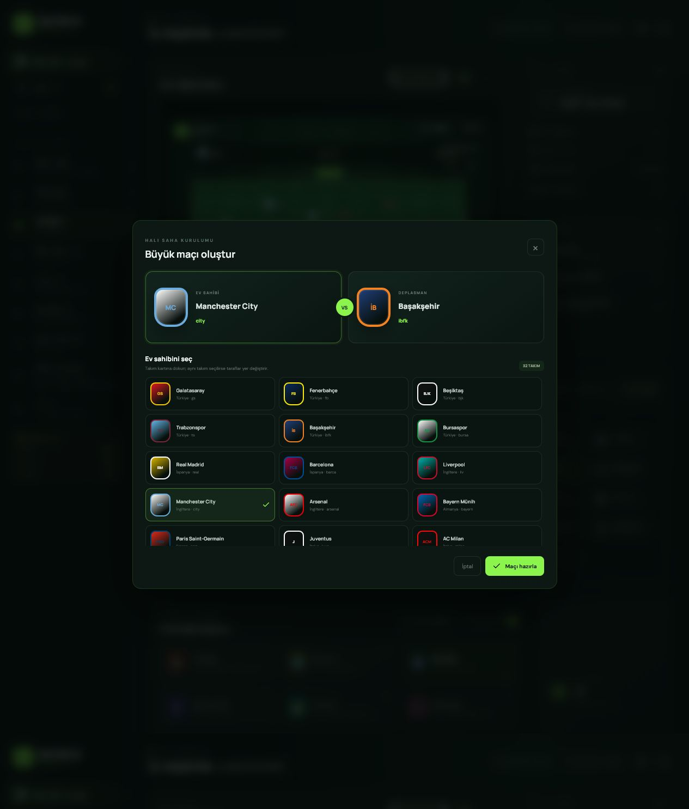

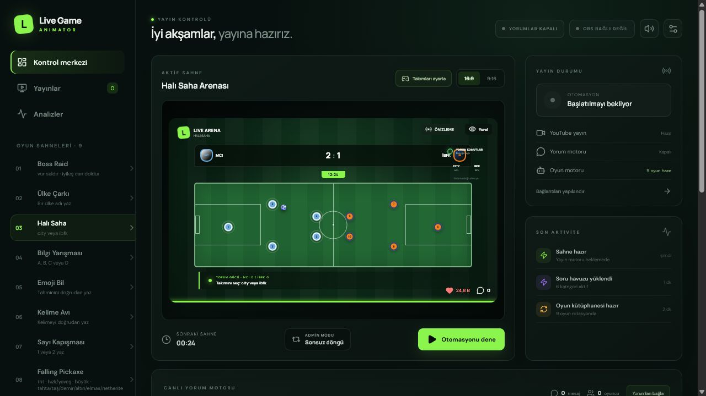

## Teslimat içeriği

- Live Game Animator uygulaması
- Dokuz oyun sahnesi ve yönetim paneli
- OBS Browser Source kurulumu
- YouTube canlı yorum bağlantısı
- TikTok / harici yorum webhook noktası
- Windows tek tıkla başlatma betiği
- Yerel veri kaydı ve analiz ekranları
- Kurulum ve kullanım dokümanları

## Sistem gereksinimleri

- Windows 10 veya Windows 11
- Node.js 20 veya üzeri
- OBS Studio 28 veya üzeri
- Canlı yayın ve platform API'leri için internet bağlantısı
- YouTube yorum entegrasyonu için Google Cloud üzerinde etkin YouTube Data API v3 anahtarı
- TikTok yorum entegrasyonu için uyumlu üçüncü taraf/kendi yorum köprünüz

## Sık sorulan sorular

**Yayıncı bilgisayar başında olmak zorunda mı?**  
Hayır. Kurulum tamamlandıktan sonra otomatik oyun rotasyonu veya seçili oyunda sonsuz döngü kullanılabilir. İşletim sistemi, internet veya OBS kaynaklı kesintiler için yayıncının kendi yeniden başlatma düzenini kurması önerilir.

**YouTube ve TikTok'ta çalışır mı?**  
OBS üzerinden her iki platforma da görüntü gönderilebilir. YouTube yorumları doğrudan API ile; TikTok yorumları ise uyumlu yorum köprüsü üzerinden oyuna aktarılır.

**Her komutta `!` kullanmak gerekli mi?**  
Hayır. Ünlem işareti isteğe bağlıdır.

**İçerikler değiştirilebilir mi?**  
Oyun sırası, süreler ve takım eşleşmeleri panelden değiştirilebilir. Soru/kelime havuzlarında özel geliştirme ihtiyacı ayrıca değerlendirilebilir.

**Sistem para kazanmayı veya 4.000 saati garanti eder mi?**  
Hayır. Bu ürün etkileşim ve yayın otomasyonu aracıdır; platform politikaları, izleyici ilgisi ve kanal performansı yayıncıya bağlıdır.

## Fiyat ve iletişim

- **Lisans / Paket fiyatı:** `[FİYAT]`
- **Demo videosu:** `[DEMO VİDEOSU]`
- **Satın alma:** `[SATIN ALMA LİNKİ]`
- **İletişim:** `[İLETİŞİM]`

Kurulum kapsamı, lisans modeli, güncelleme süresi ve destek şartları satın alma öncesinde açıkça belirtilmelidir.
